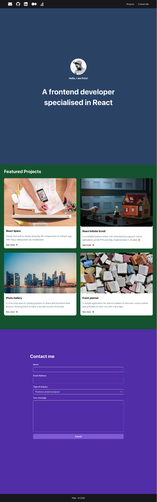

# Meta React Portfolio App

This is my submission for the Meta React Portfolio project that is the ending capstone for the `Advanced React` course within the Front-End Engineer certification track. The grading criteria/project requirements are as follows:

## Portfolio page functionality

When interacting with the portfolio app in the UGL or VS Code:

- Did the header have external links that take you to different social apps?
- Did the header have internal links that, when clicked, will smoothly scroll into their corresponding section?
- Was the landing section filled with an avatar, name and a short bio?
- Did the project section display a 2x2 grid with each project rendered in a card widget?
- Was the Contact Me form business logic implemented as per the requirements?
- Was the header hidden/shown depending on the scroll direction? Did it happen with a smooth transition animation?
- Can you suggest any improvements for the portfolio app?

### Expected Solution Screenshot

